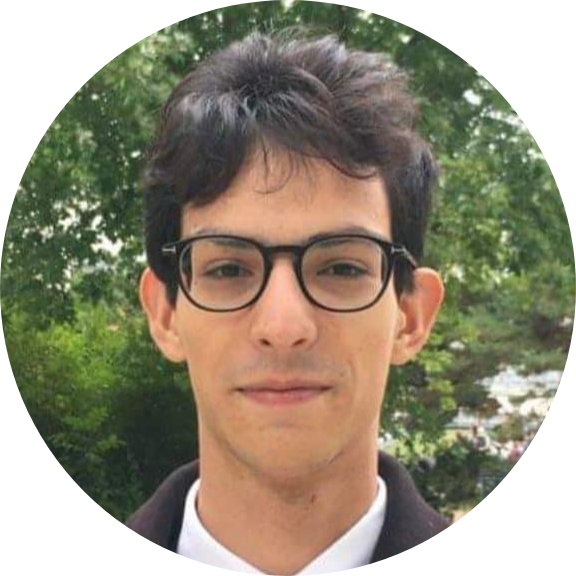

Gonçalo Maia Giga
---------------------------------------------------------------
Student Engineer in Computer Science and Artificial Intelligence
---------------------------------------------------------------

:mailbox:  3 Rue Jacques Kablé, Strasbourg 67000 &nbsp;
@          goncalo.casimiro-matias-maia-giga@etu.unistra.fr
&nbsp;   &nbsp;&nbsp;&nbsp;&nbsp;&nbsp;&nbsp;&nbsp;&nbsp;
:birthday: 15 October 1999                       &nbsp;
:round_pushpin: Strasbourg, FRANCE               &nbsp;
:phone:    0789328921                            &nbsp;

## Professional Experience

#### Volunteer Work In a Hospital

* :date: July 2015 and July 2016 &nbsp;&nbsp;&nbsp;&nbsp;&nbsp;&nbsp;&nbsp;&nbsp;
:round_pushpin: Hospital de São Francisco Xavier, Lisbon, Portugal

> During my two months of **volunteer work in the emergency room of SFX
> Hospital**,
> I did three main things: I served food to patients who could not eat alone,
> went into the waiting rooms to sell breakfast, and organized a store to finance the
> emergency room staff. Thanks to this experience, of which I am particularly proud,
> I was able to understand the suffering of others whith much more lucidity.
> This kind of work was a little unusual for my age (I was 16 at the time),
> which allowed me to maintain, from that age, a desire to study science
> in the hope of helping others. Today, more than ever, this hope still remains in me.

#### Electricité de Strasbourg

* :date: January 2021 to Mars 2022 &nbsp;&nbsp;&nbsp;&nbsp;&nbsp;&nbsp;&nbsp;&nbsp;
:round_pushpin: Strasbourg, France 

> In early 2021, I started working on a project with the électricité de
> Strasbourg (ES). The goal of my work is to **come up with a solution to classify intelligently
> their large email database with Natrual Language Processing techniques**, and if such task is achieved before 2022, to also
> categorize the calls they recieve on a daily basis. I am supervised by the
> CIO of ES with whom I also participated in an hackaton where I created
> a simple chatbot for ES and learned a lot about the pratical ways one can
> implement Natural Language
> Understanding.

## Technical Experience

#### Travelling Salesman Problem

* :date: July 2018- July 2019 &nbsp;&nbsp;&nbsp;&nbsp;&nbsp;&nbsp;&nbsp;&nbsp;
:round_pushpin: Paris, France

> My first ever computer science project, started in 2019 when I was in
> a *classe préparatoire aux grandes écoles*. The goal of my project was to
> understand and **use an Hopfield Network that could converge to a satisfactory
> solution of the TSP**. At that time, I did not have enough technical experience
> to really implement my solution but I still learned a lot about Hopfield
> Networks, and neural networks in general.

[Here is a link to my project
report](https://drive.google.com/file/d/164MQsrEAp4pJia6GVskApi1VYBi_ZqrA/view?usp=sharing).

#### C/C++ projects

* :date: Sempteber 2019 - June 2020 &nbsp;&nbsp;&nbsp;&nbsp;&nbsp;&nbsp;&nbsp;&nbsp;
:round_pushpin: Strasbourg, France

> When I first started Computer Science (in 2019) I did multiple basic projects
> in C and C++. **A program to find the best route in the Paris subway** (written
> in C), **a chess game engine** (written in C++) and **a simplified version of
> CMake** (written in C++ and yacc/bison). I recently added this last project to
> the Git of my Computer Science association ITS:

[The link to the last project
git](https://github.com/info-telecom-strasbourg/code-generator)

#### Making a Pascal Compiler for a MIPS architecture

* :date: Sempteber 2020 - December 2020 &nbsp;&nbsp;&nbsp;&nbsp;&nbsp;&nbsp;&nbsp;&nbsp;
:round_pushpin: Strasbourg, France

> Me and 4 other students of Télécom Physique Strasbourg, built **a compiler for
> a simplified version of Pascal**, called Scalpa. The compiler works for a MIPS
> architecture and outputs code written in mips assembly code. The compiler is
> written in C, using yacc and buison for the syntax and lexical analysis. The
> code is avaible in the teams's git. In order to be tested it is neccesary to
> use a mips processor emulator; we used spim for that.

[The git of the compiler](https://git.unistra.fr/bcoriat/scalpa-compilator)

#### Statistical AI, Machine Learning and Genetic Programming

* :date: from Sempteber 2020 &nbsp;&nbsp;&nbsp;&nbsp;&nbsp;&nbsp;&nbsp;&nbsp;
:round_pushpin: Strasbourg, France

> The first IA project I did, used R and **statistical analysis to cluster food habits
> and political speeches**. After this introduction, I was able to **solve a shedule
> problem for the University of Strasbourg using an Artificial Evolution
> platform called easena**. Then, **I tested both UNet and ResNet neural networks,
> when participating in a challenge aimed at predicting the ground mask of
> satellite imagery**.

[A link to my first project
report](https://drive.google.com/file/d/1MVTgKGxr-k3oWKnd00beEuFNYf84Ly4l/view?usp=sharing)

#### Natural Language Processing

* :date: from Sempteber 2020 &nbsp;&nbsp;&nbsp;&nbsp;&nbsp;&nbsp;&nbsp;&nbsp;
:round_pushpin: Strasbourg, France

> While working with ES, me and **my team used NLP statistical and probabilistic algorithms
> such as LSI, pLSI and LDA to classify an email data base** into different
> topics. **We are also working with BERT** (actually the french version
> camenBERT), in an attempt to create a somewhat
> hybrid model that applies both probabilistic appproches like LDA and also deep
> learning. When creating a chat bot for ES, **I used RASA** (a powerfull NLU tool
> using tensorflow) **and Node RED in order to create a bot that helps ES clients
> with eletrical problems in their houses**.

## Technical Skills

#### Programming Languages
> Languges I love and use quite often | Languages I know but don't use that often:
> -- | --
> **C/C++** | **Erlang**
> **Python** | **OCaml**
> **Java** | **Pascal**
> **R** |
> **Matlab** |

#### Web/Database skills
Web and Database is not my specialty, yet I still played around, in my
free time, with:
> * **HTML**
> * **CSS**
> * **PHP**
> * **SQL**

#### Operating systems
> * **Windows**
> * **Linux**

Since I first started using Linux in 2019, I never managed to stop. As for the
distribution, I use either Debian (for a server I have at home) or Ubuntu (for
my laptop)

#### Document Preparation
> * **Latex**
> * **Markdown**

I used Latex for almost everything for a long time, but now I'm taking a shot at Markdown, from which this very CV is made : )

## About Myself

#### My Hobbies

When I'm outside of the Computer Science world, I mostly like to read. During
the previous years, I have mostly read philosophy, which was a passion of mine
for a long time. Now, I'm starting to read on other subjects, like politics,
sociology or more recent papers on Computer Science. I'm trying to learn more
about economics on my free time, and found out it is something I quite enjoy
too !

#### Languages
I spent half of my live in France and half of my live in Portugal. I'm
therefore fluent in both French and Portuguese. I'm also fluent in English, or
at least good enough to understand and to be understood.

> * **French**
> * **Portuguese**
> * **English**

## My Education

#### Master's degree in CS; University of Strasbourg
* :date: from September 2020 to today &nbsp;&nbsp;&nbsp;&nbsp;&nbsp;&nbsp;&nbsp;&nbsp;
:round_pushpin: Strasbourg, France

> Since 2020, I'm doing a double's degree alowing me to do both the Engineer
> school (*Télécom Physique Strasbourg*) and a master's degree in Computer
> Science (*Université de Strasbourg*)

#### Télécom Physique Strasbourg Engineer School

* :date: from September 2019 to today &nbsp;&nbsp;&nbsp;&nbsp;&nbsp;&nbsp;&nbsp;&nbsp;
:round_pushpin: Strasbourg, France

> I entered Télécom Physique Strasbourg after passing the exam of the *grandes
> écoles d'ingénieur*. Télécom Physique Strasbourg is an engineer school inside
> the *Institut Mines-Télécom* academic institution.

#### Preparatory Class

* :date: September 2017 - July 2019 &nbsp;&nbsp;&nbsp;&nbsp;&nbsp;&nbsp;&nbsp;&nbsp;
:round_pushpin: Paris, France

> After Highschool, I entered a preparatory class (*classe préparatoire aux
> grandes écoles*) at the *Lycée Chaptal* in Paris.

#### Lycée Français Charles Lepierre
* :date: September 2011 - July 2017 &nbsp;&nbsp;&nbsp;&nbsp;&nbsp;&nbsp;&nbsp;&nbsp;
:round_pushpin: Lisbon, Portugal

> This is the highschool I atended, in the center of my home city, Lisbon <3

